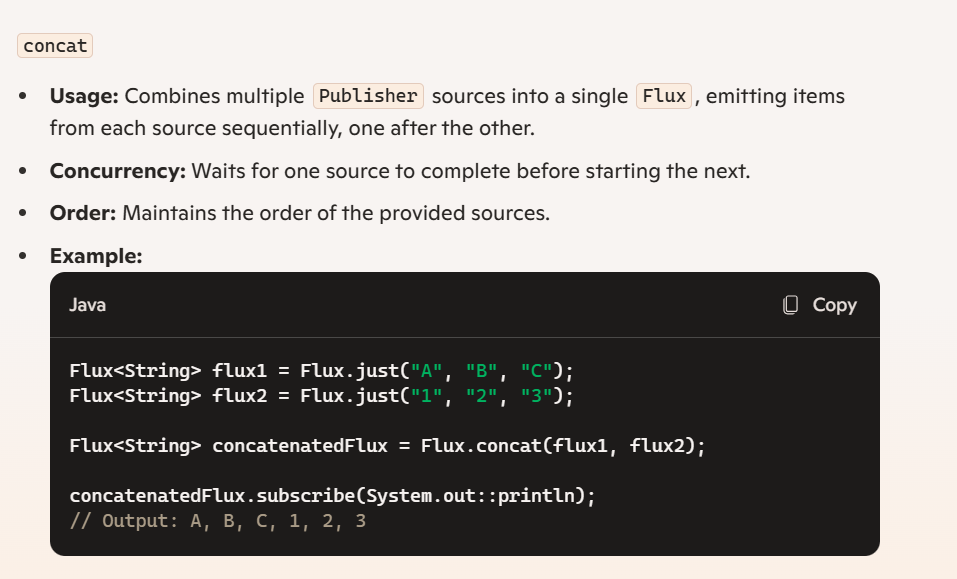
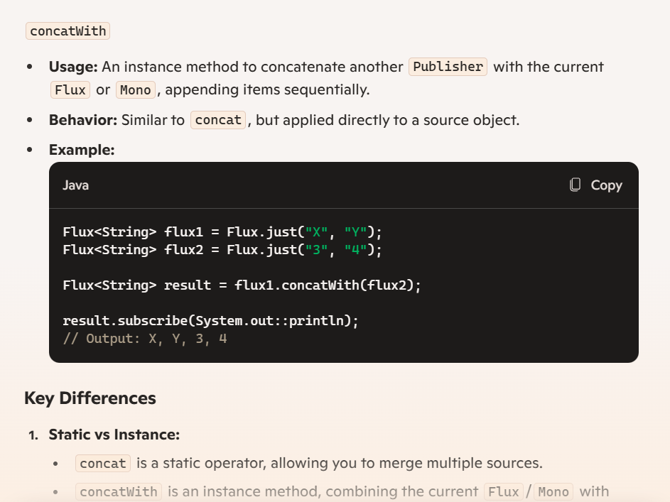
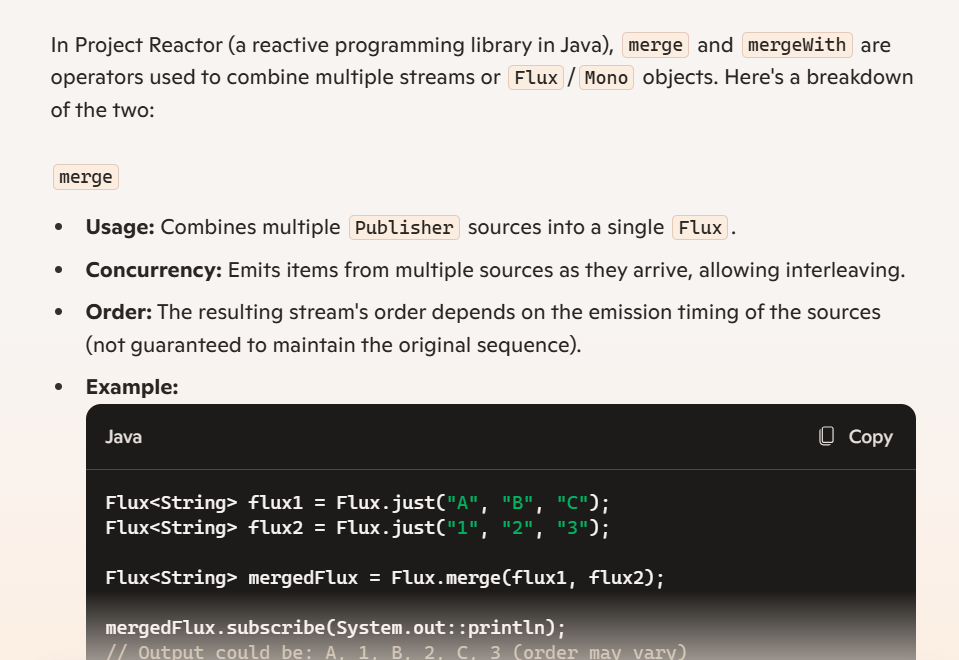
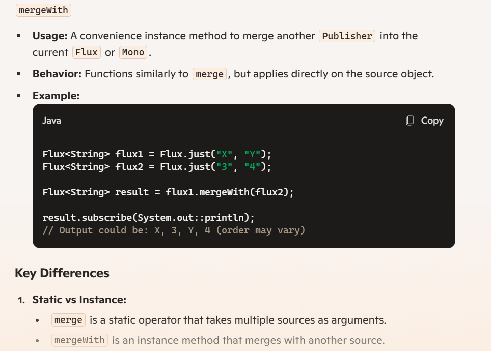
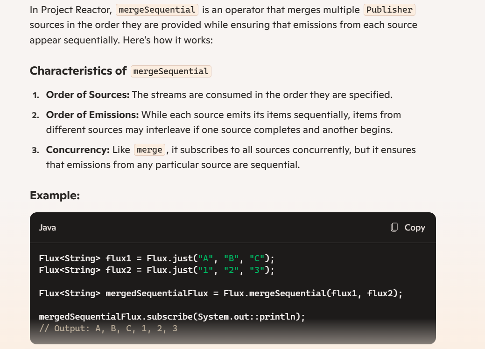
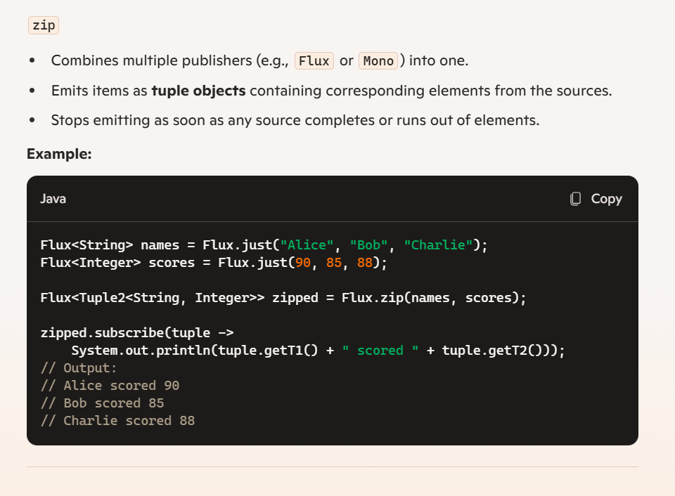
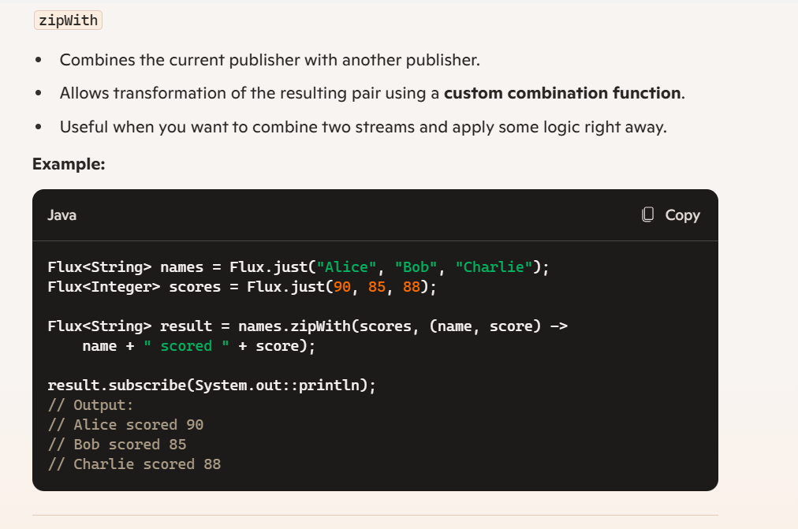
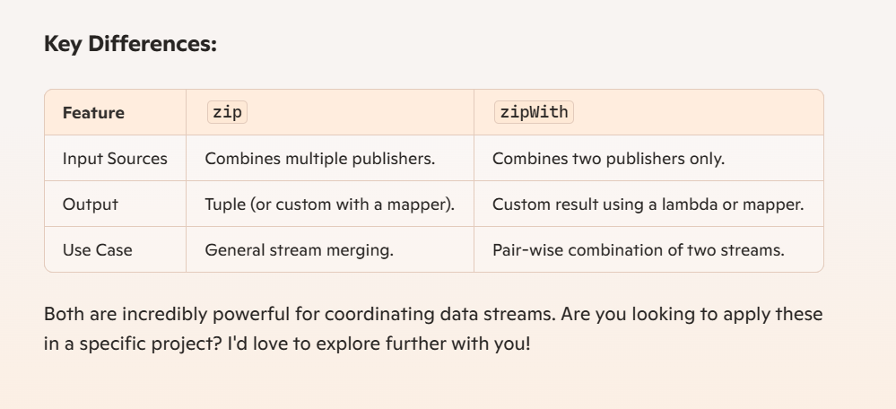
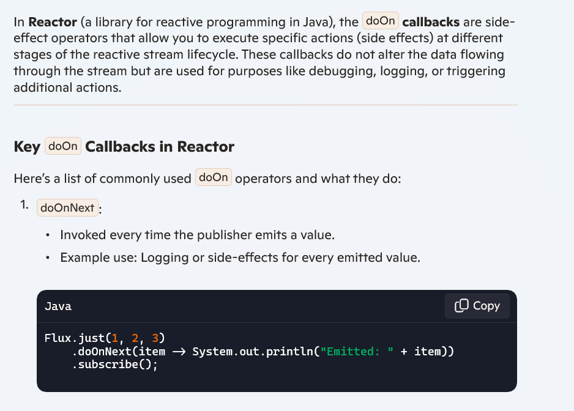

<h3> Project Reactor with Java </h3>
<h6> This project starts from package first which has examples of popular methods of flux and mono</h6>

<div>

1. **Flux**: In reactive streams,
   Flux is a publisher that can emit 0 to N items.
   It's a concept from **Project Reactor**,
   which is a reactive library built on the Reactive Streams specification.
   Flux is used to handle multiple elements (like a stream of data) asynchronously,
   and it provides operators to transform, filter, merge, and manipulate the data stream.

2. **Mono**: Mono is another type of publisher from **Project Reactor**,
   it focuses on emitting **0 or 1 item**.
   It's typically used for scenarios where you either want to deal
   with a single result or a possible absence of a result
   (like querying a database for a single entry or making a network request).

In short:
- Use **Flux** when working with multiple elements.
- Use **Mono** when dealing with a single element or optional results.

</div>

<div>

<b>Just Method : </b> the method `just()` in Flux and Mono is a factory method used to create a publisher from a given value or values.

1. **Mono.just()**:
    - It creates a `Mono` that emits the single value provided to it.
    - For example:
      ```java
      Mono<String> mono = Mono.just("Hello, Mono!");
      ```
      Here, the `Mono` will emit the value `"Hello, Mono!"` and then complete.

2. **Flux.just()**:
    - It creates a `Flux` that emits multiple values provided to it (or even a single value).
    - For example:
      ```java
      Flux<Integer> flux = Flux.just(1, 2, 3, 4, 5);
      ```
      Here, the `Flux` will emit the values `1, 2, 3, 4, 5` in sequence and then complete.

**Key Differences**:
- `Mono.just()` is for a single element.
- `Flux.just()` is for multiple elements.

</div>

<b>Different Methods in Reactor with Flux and Mono</b>

---> map() vs flatmap() in Reactor 

In Reactor Java, both map and flatMap are used to transform elements in a stream, but they serve different purposes and operate in distinct ways:

<b> map Operator Purpose: </b>

1. The map operator is used to transform each element in the stream into another element.
2. It does support only simple  synchronous operations
3. 1 to 1 transformation 
Usage: It takes a function that converts each element from one type to another.

Example: If you have a Flux<String> and you want to convert each string to uppercase, you can use map:

```java
Flux<String> flux = Flux.just("hello", "world");
Flux<String> upperFlux = flux.map(String::toUpperCase);
```

This will produce a Flux with elements "HELLO" and "WORLD".

<b>flatMap Operator Purpose: </b>
1. The flatMap operator is used to transform each element in the stream into another stream, and then flatten these streams into a single stream.
2. Also it supports async operations
3. 1 to N operations

Usage: It takes a function that converts each element into a Publisher (another stream).

Example: If you have a Flux<String> and you want to split each string into individual characters, you can use flatMap:

```java
Flux<String> flux = Flux.just("hello", "world");
Flux<String> charFlux = flux.flatMap(s -> Flux.fromArray(s.toCharArray()));
This will produce a Flux with elements "h", "e", "l", "l", "o", "w", "o", "r", "l", and "d".
```

Key Differences
Single vs. Multiple Streams: map transforms each element individually, while flatMap can transform each element into multiple elements (a stream of streams).

Flattening: flatMap flattens the resulting streams into a single stream, whereas map does not.

<div><b> Difference betwen concat and concat with</b></div>





<div><b>Difference between merge and merge with</b></div>





<div>
Ease of Use:

1. Use merge for combining three or more sources.
2. Use mergeWith for two sources when one is already in hand.
</div>


<div> <b> merge sequential </b></div>



<div><b> Difference between zip and zipWith</b></div>

1. zip is static method part of Flux
2. can merge upto 2 to 8 publishers ( FLux or Mono to 1)




1. zipwith is an instance method part of flux and mono
2. used to merge two publishers to one






**
1. Publishers are subscribed eagerly
2. waits for all publishers involved in transformation to emit one element
3. continues until one publisher sends an Oncomplete event

<div>Demo Illustration of getAllMovies and getMovieById in MovieReactiveService </div>

<h3>doOnCallBack</h3>

<div>

1. These Operator allow to peek into events that are emitted by publisher(flux or mono)
2. They are also called side effect operator
3. They dont change sequence at all
4. There are many different callback operators that are available in project reactor

   a. doOnSubscribe()
   b. doOnNext()
   c. doOnComplete()
   d. doOnError()
   e. doFinally()

</div>



<h3> Exception In Reactive Stream </h3>

<div>**Any exception will terminate reactive stream</div>

Two Categories of Operator

Category 1 : Recover from an Exception
Category 2 : Take an action on exception and re-throw the exception

Recover from an Exception

1. onErrorReturn() -> catches the exception, return default value
2. onErrorResume() -> catches the exception, return recovery flux
3. onErrorContinue() -> catches the exception, drop elements which caused exception, continue
   emitting remaining elements

Take an action on exception and rethrow the exception

1. onErrorMap() -> catches the exception, transform exception to custom/business exception, once
   exception encountered, no elements are further emitted
2. doOnError() -> catches the exception, takes action when exception occurs, side effect operator
   does not modify reactive stream output, error still gets propagated to caller

onErrorReturn()
-> catch the exception
-> This also provides singe default value as a fallback value

retry()
-> use this operator to retry failed exception
-> code interacts with extenal systems through network. Ex - RestFul API Calls, DB Calls

retry()-> retry failed exception indefinetely
retry(N)-> retry failed exception N number of times, N is a long value

retryWhen()-> more advanced
conditionally perform retry on specific exceptions

repeat()
--> repeat an existing sequence
--> this operator gets invoked after onCompletion() event from existing sequence
--> Use it when you have to subscribe to same publisher again
--> This operator works as long as no exception is thrown

repeat() --> subscribes to operator indefinitely
repeat(N) --> subscribes to the publisher N times


